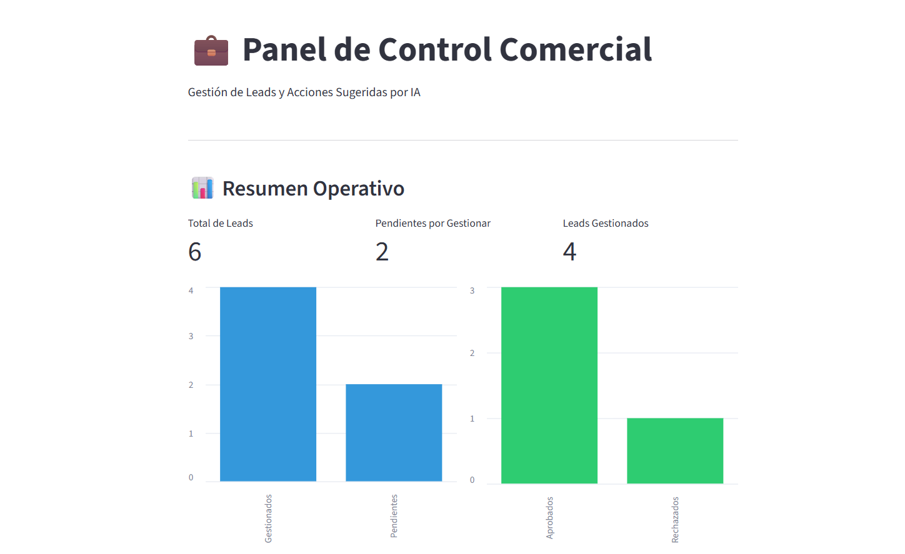
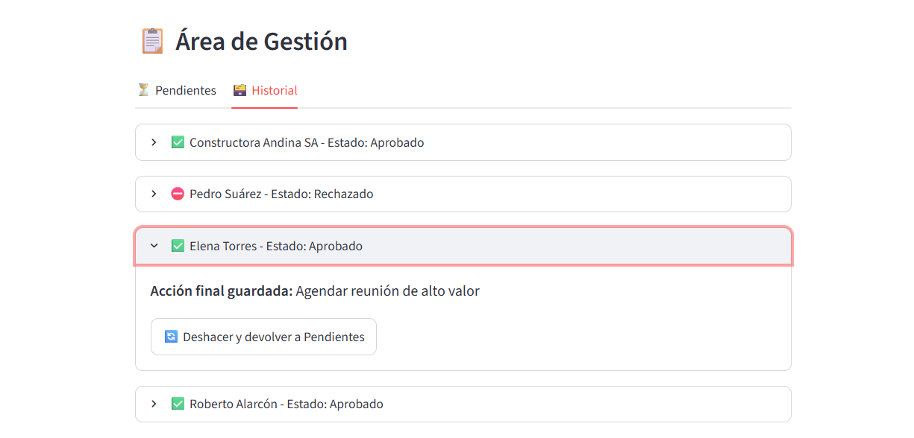
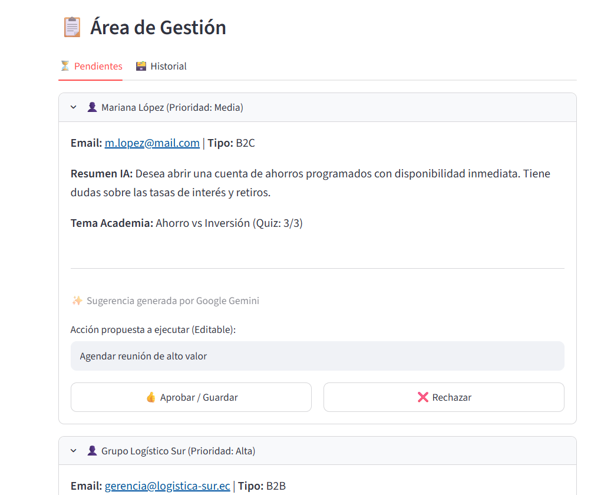

# AgenticScale - CRM Financiero Inteligente (Track 1)
Evento: Agentic Scale Ecuador Tech Week 2026 | Periodo: 2026-1 | Estado: Completado

## Equipo de trabajo
- Diego Moscol ([Fergaku](https://github.com/Fergaku/Fergaku))
- Eddy Lima ([elima-hub](https://github.com/elima-hub))
- José Andrés Viteri Hoyos ([jvit04](https://github.com/jvit04))

## Capturas / Demo




*(Link de despliegue en producción: [Insertar enlace de Streamlit Community Cloud aquí])*

## Funcionalidad Multi-Agente
- [x] **HU1 - Tutor Financiero Automatizado:** Interfaz interactiva de chat orientada a la capacitación inicial de leads en conceptos de inversión y educación financiera.
- [x] **HU2 - Evaluación y Segmentación con Persistencia:** Motor de persistencia unificado que evalúa el rendimiento en quizzes financieros y genera un perfil conversacional estructurado.
- [x] **HU3 - Panel de Control Comercial Asistido por IA:** Dashboard directivo minimalista que procesa leads entrantes, renderiza métricas operativas con Pandas y utiliza la API de Google Gemini para proponer acciones comerciales estructuradas (Agendar, Enviar material | Derivar B2B) manteniendo la validación humana en el bucle ("Human-in-the-Loop").

## Tecnologías
`Python` `Streamlit` `Google GenAI SDK` `Pandas` `JSON` `Git`

## Ejecución
### Instrucciones paso a paso para Evaluación

#### Opción 1: Acceso Directo al Despliegue en la Nube (Recomendado)
1. Ingrese de manera directa al enlace de producción alojado en Streamlit Cloud: `[Insertar URL de Streamlit Cloud]`.
2. Explore el Resumen Operativo y apruebe/rechace acciones en tiempo real sobre los datos históricos cargados.

#### Opción 2: Despliegue Técnico Local (Vía Terminal)
1. Clone el repositorio remoto y acceda al directorio raíz:
```bash
git clone [https://github.com/jvit04/Concurso_Hackaton_AgenticScale.git](https://github.com/jvit04/Concurso_Hackaton_AgenticScale.git)
cd Concurso_Hackaton_AgenticScale
```
2. Instale las dependencias oficiales requeridas:
```bash
pip install streamlit google-genai pandas python-dotenv
```
3. Configure sus credenciales locales. Cree el archivo .streamlit/secrets.toml y añada su API Key:
```bash
GEMINI_API_KEY = "Tu_Clave_Privada_De_Google"
```
4. Ejecute el panel de control del agente comercial:
```bash
python -m streamlit run hu3_seguimiento_comercial/app.py
```

## Calidad, Confiabilidad y Casos de Prueba (Nivel Mínimo Exigido)
A continuación se detallan los casos de prueba manuales ejecutados para validar la lógica antialucinación del Agente Comercial:
Caso de Prueba | Input del Lead (Contexto) | Resultado Esperado (Acción) | Resultado Obtenido | Estado
---|---|---|---|---
01 - Cliente Corporativo | Empresa con excedente de liquidez, presupuesto $120,000, busca rentabilidad a corto plazo. | Derivar a especialista B2B | Derivar a especialista B2B | Pasado
02 - Lead Minorista Bajo Presupuesto | Estudiante, presupuesto $50, busca opciones rápidas no reguladas. | Enviar material educativo introductorio | Enviar material educativo introductorio | Pasado
03 - Lead Minorista Alto Valor | Profesional independiente, presupuesto $8,000, perfil conservador a largo plazo. | Agendar reunión de alto valor | Agendar reunión de alto valor | Pasado

## Métricas de Progreso
| Indicador | Valor |
|---|---|
| Total de Leads en Base Inicial | 6 Registros Estructurados |
| Estado de Implementación | 100% Funcional (Fase 1) |
| Cobertura de Pruebas Manuales | Casos Críticos de Mitigación de Riesgos Validados |
| Última actualización | 2026-07-11 |

## Reflexión y Aprendizajes (Conceptos Clave del Evento)
- **Habilidades desarrolladas:** Integración del nuevo SDK de google-genai para orquestación de prompts financieros cerrados, optimización de flujos de trabajo directivos mediante componentes visuales de Streamlit y control preventivo de conflictos en Git mediante aislamiento de datos asíncronos.
- **Mitigación de Riesgos:** Aplicación de ingeniería de prompts estricta para forzar respuestas categóricas en el LLM, eliminando por completo el riesgo de alucinación de datos financieros o tasas de interés inventadas.

- **Qué se podría mejorar:** Evolucionar la persistencia de datos local basada en archivos estructurados JSON hacia una base de datos distribuida en la nube (como PostgreSQL o Neon) para entornos empresariales de alta concurrencia.
